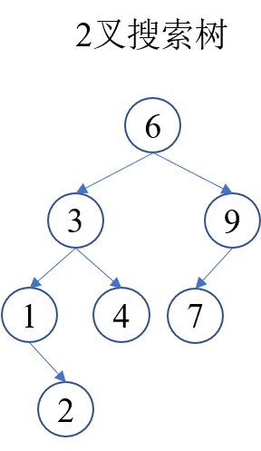
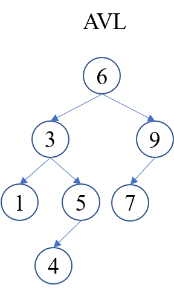
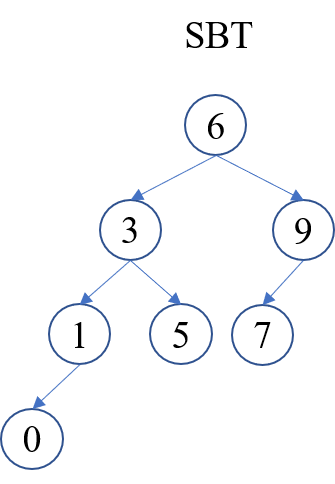
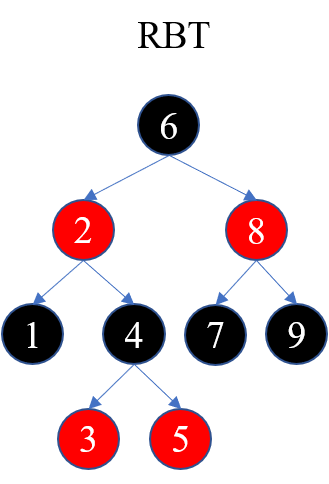
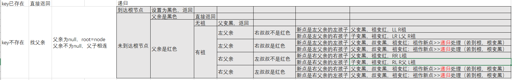
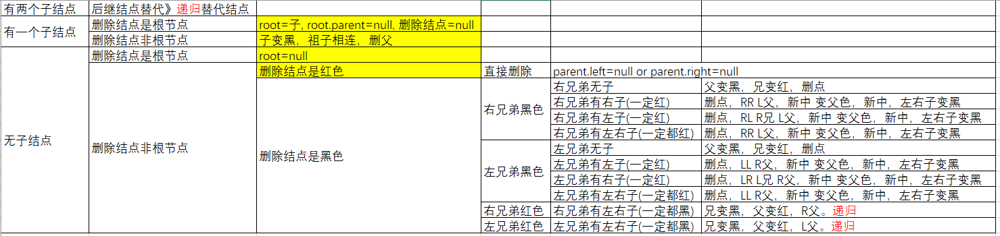
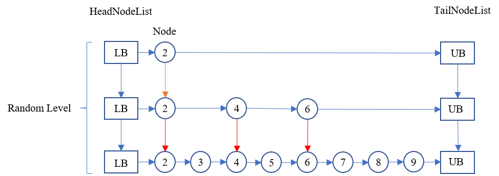

# BST (Binary Search Tree)

- 搜索二叉树是AVL, SBT, RBT 的基础
- AVL, SBT, RBT 他们的区别只在于平衡标准不同

性质
- 左子树的值<根节点
- 右子树的值>=根节点
# AVL (Adelson-Velsky and Landis Tree)

平衡标准：高度，|左子树height-右子树height|<=1

平衡操作
- LL: 右旋
- RR: 左旋
- LR: 左旋 再右旋
- RL: 右旋 再左旋

时间复杂度：O(n)
空间复杂度：O(log n)
# SBT (Size Balanced Tree)

平衡标准：数量, 每棵叔叔树的大小>=所有侄子树的大小

平衡操作：需要 对孩子结点发生变化的结点 继续调整
- LL: 右旋，T 左孩子 L，m(T) m(L)
- RR: 左旋，T 右孩子 R，m(T) m(R)
- LR: 左旋 再右旋，T 左孩子 L 右孩子 lR，m(T) m(L) m(lR) 
- RL: 右旋 再左旋，T 右孩子 R 左孩子 rL，m(T) m(R) m(rL) 

时间复杂度：O(n)
空间复杂度：O(log n)
# RBT (Red-Black Tree)

平衡标准：倍数, 任意结点到叶子结点的最长长度 `<=` 此结点到叶子结点的最短长度的2倍

插入平衡操作：

删除平衡操作：

性质：
- 结点是红色或黑色
- 根结点是黑色，叶结点是黑色（叶子是NULL结点）
- ！！每个红色结点的两个子结点都是黑色（从每个叶子到根的所有路径上不能有两个连续的红色结点）。可以黑黑不能红红
- ！！从任一结点到其每个叶子的所有路径都包含相同数目的黑色结点

时间复杂度：O(n)
空间复杂度：O(log n)
# SkipTable (Skip-Table)

特点：
- 利用了高度跳过了大量无关结点
- 与数据的输入情况无关
- 空间来换取时间

跳表性质：
- 每个结点包含两个指针，next，down
- 每一层都是一个有序的链表
- 元素会在level i以下所有层出现，level 0包含所有元素

跳表Java实现：
- ConcurrentSkipListMap
- ConcurrentSkipListSet

时间复杂度：O(n)
空间复杂度：O(log n)